# 🚀 Awesome Decentralized Clinical Trials (DCT) Platform Ecosystem 🧪

     

A curated collection of leading **SaaS platforms**, **Open-Source GitHub projects**, and **digital health frameworks** for **Decentralized Clinical Trials (DCT)**. This repository empowers trial sponsors, Contract Research Organizations (CROs), site investigators, and healthtech developers to explore solutions for remote patient engagement, Electronic Data Capture (EDC), eConsent, ePRO/eCOA, telemedicine, and decentralized trial orchestration.

---

## 📑 Table of Contents

- [📊 Sector Overview & Market Dynamics](#-sector-overview--market-dynamics)
- [🏢 SaaS & Hosted DCT Platforms](#-saas--hosted-dct-platforms)
- [🔓 Open-Source GitHub Repositories](#-open-source-github-repositories)
- [🤝 How to Contribute](#-how-to-contribute)
- [⚠️ Disclaimer & Regulatory Compliance](#%EF%B8%8F-disclaimer--regulatory-compliance)
- [📈 Star History](#-star-history)
- [💖 Support & Community](#-support--community)

---

## 📊 Sector Overview & Market Dynamics

> 💡 **Market Size Estimate**: The global Decentralized Clinical Trials (DCT) market size is estimated at **$10 billion to $11.5 billion in 2026**, projected to expand at a **~13.5% CAGR** reaching **$29 billion to $38 billion by 2035**.
>
> 🏗️ **Market Structure**: The sector is **moderately concentrated**—led by established enterprise clinical technology giants (e.g., Oracle, Veeva, Clario) expanding into DCT alongside high-valuation pure-plays (Medable, Science 37). However, regional regulatory differences (GDPR, HIPAA, NMPA) and specialized clinical needs preserve fragmentation, allowing agile open-source and niche tools to thrive.

---

## 🏢 SaaS & Hosted DCT Platforms

The following commercial SaaS solutions provide end-to-end decentralized trial orchestration, multi-site compliance, and global patient engagement. *Sorted by Company Size (Revenue / Valuation) descending.*

| Platform | Company Size (Revenue / Valuation) | Starting Tier Pricing | Free Tier Limit | Key Capabilities & Focus |
| :--- | :--- | :--- | :--- | :--- |
| **[Oracle Clinical One](https://www.oracle.com/life-sciences/clinical-research/)** 🏢 | **Oracle Corp** (~$50B Annual Revenue / ~$350B Market Cap) | Starting at ~$2,000/month per active study module | 30-day guided interactive demo & trial sandbox (enterprise access upon request) | Unified eClinical platform integrating EDC, RTSM, CDM, and direct-to-patient supply management. |
| **[Veeva Vault](https://www.veeva.com/products/vault-edc/)** ⚡ | **Veeva Systems** (~$2.4B Annual Revenue / ~$30B Market Cap) | Starting at ~$1,500/month per study protocol | 30-day sandbox trial for qualified research sponsors (no free-forever plan) | Cloud EDC, CTMS, and eTMF with no-code form designer used across 1,000+ global clinical studies. |
| **[Medable](https://www.medable.com/)** 🚀 | **~$2.1B Valuation** (Unicorn / $521M+ Funding) | Starting at ~$3,500/month per protocol | 14-day trial sandbox for trial design & protocol simulation (no free-forever plan) | Patient-centric DCT platform with eConsent, ePRO/eCOA, BYOD remote monitoring, and virtual visits. |
| **[Clario](https://clario.com/)** 🩺 | **~$1.0B+ Valuation** (~$800M+ Annual Revenue) | Starting at ~$4,000/month per endpoint module | Interactive demo environment with 1 sample eCOA protocol configuration | Clinical endpoint technology leader specializing in eCOA, ePRO, cardiac safety, and respiratory trials. |
| **[Signant Health](https://www.signanthealth.com/)** 🌐 | **~$500M+ Annual Revenue** (Genstar Capital) | Starting at ~$3,000/month per trial module | Custom demo sandbox environment with guided eConsent trial setup | Clinical outcome assessment specialist (eCOA, eConsent, RTSM) with multi-language validation. |
| **[THREAD Science](https://www.threadresearch.com/)** 📱 | **~$400M Valuation** (Water Street / JLL) | Starting at ~$2,500/month per site deployment | Protocol design builder demo & sandbox trial with sample patient portal | Turnkey DCT platform bringing clinical research home via virtual visits, ePRO, and sensors. |
| **[Science 37](https://www.science37.com/)** 🔬 | **~$100M+ Valuation** (Acquired by eRT/eClinical) | Starting at ~$2,000/month per virtual site | Metasite sandbox demo with 1 sample virtual study workspace | Metasite platform unifying virtual trial enrollment, eConsent, telemedicine, and mobile nurses. |
| **[ObvioHealth](https://www.obviohealth.com/)** 📊 | **~$50M Valuation** ($60M+ Total Funding) | Starting at ~$1,800/month per study setup | 14-day interactive trial portal for study team protocol preview | DCT pure-play focused on remote patient engagement, digital biomarkers, and eCOA data capture. |
| **[Castor](https://www.castoredc.com/)** 🎓 | **~$45M Valuation** ($65M+ Total Funding) | Starting at $1,250/month (Commercial) | **Free Forever Plan**: 1 free non-commercial research study (up to 100 participants, EDC module) | Self-service EDC, eConsent, and ePRO platform widely used in academic & investigator-led trials. |
| **[Curebase](https://www.curebase.com/)** 💊 | **~$40M Valuation** ($40M+ Series A/B) | Starting at ~$1,500/month per active site setup | 14-day trial environment for protocol configuration & workflow testing | Decentralized clinical trial platform uniting eConsent, ePRO, telemedicine, and community sites. |

---

## 🔓 Open-Source GitHub Repositories

Open-source clinical research software offers flexibility, transparency, and data ownership. *Sorted by GitHub Star Count descending.*

1. **[Medplum](https://github.com/medplum/medplum)** 
   - 📜 **License**: Apache-2.0
   - 📌 **Description**: Headless EHR and healthcare developer platform featuring open FHIR APIs, eConsent workflows, patient portals, and customizable clinical research infrastructure.

2. **[OpenClinica](https://github.com/OpenClinica/OpenClinica)** 
   - 📜 **License**: LGPL-2.1
   - 📌 **Description**: Pioneering commercial open-source Electronic Data Capture (EDC) and Clinical Data Management (CDM) system for global clinical research trials.

3. **[Teal](https://github.com/insightsengineering/teal)** 
   - 📜 **License**: Apache-2.0
   - 📌 **Description**: Shiny-based exploratory web application framework for analyzing clinical trial data, developed under the pharmaverse open-source initiative.

4. **[Clinical-Trial-Parser](https://github.com/facebookresearch/Clinical-Trial-Parser)** 
   - 📜 **License**: CC-BY-NC-4.0
   - 📌 **Description**: NLP/ML library developed by Meta Research to parse unstructured clinical trial eligibility criteria into standardized machine-readable formats.

5. **[Pryv.io](https://github.com/pryv/open-pryv.io)** 
   - 📜 **License**: BSD-3-Clause
   - 📌 **Description**: UN-endorsed Digital Public Good for personal data lifecycle management and decentralized trial consent (implementing GConsent ontology and cross-account messaging).

6. **[OpenDataCapture](https://github.com/DouglasNeuroInformatics/OpenDataCapture)** 
   - 📜 **License**: MIT
   - 📌 **Description**: Electronic data capture platform for administering remote and in-person clinical instruments, patient surveys, and assessments.

7. **[Tern](https://github.com/pharmaverse/tern)** 
   - 📜 **License**: Apache-2.0
   - 📌 **Description**: R package providing Table, Listings, and Graphs (TLG) library for standard clinical trial reporting within the pharmaverse ecosystem.

8. **[LibreClinica](https://github.com/reliatec-gmbh/LibreClinica)** 
   - 📜 **License**: LGPL-2.1
   - 📌 **Description**: Community-driven open-source successor to OpenClinica for Electronic Data Capture (EDC) and Clinical Data Management (CDM).

9. **[OpenEDC](https://github.com/imi-muenster/OpenEDC)** 
   - 📜 **License**: MIT
   - 📌 **Description**: Lightweight, browser-based GCP-compliant Electronic Data Capture (EDC) system for medical research and clinical studies.

10. **[Arcwell](https://github.com/arcweb/arcwell)** 
    - 📜 **License**: Apache-2.0
    - 📌 **Description**: Production-deployed open-source clinical research platform featuring integrated eCOA/ePRO within EDC and a 4,000+ rule decision engine.

11. **[OpenCDMS](https://github.com/opencdms/opencdms)** 
    - 📜 **License**: GPL-3.0
    - 📌 **Description**: Open Clinical Data Management System built to harmonize clinical trial databases and interoperate across research platforms.

12. **[PROACT 2.0](https://github.com/Proact2/proact2-platform-mobile-client)** 
    - 📜 **License**: MPL-2.0
    - 📌 **Description**: Purpose-built patient-doctor communication app for oncology clinical trials supporting text, audio, and video across 6 languages.

13. **[Trustdose-u2u](https://github.com/anushree-0805/trustdose-u2u)** 
    - 📜 **License**: MIT
    - 📌 **Description**: Decentralized clinical trial registry built on Flow blockchain using Cadence smart contracts and IPFS for auditability.

14. **[e-consent](https://github.com/vectis-lab/e-consent)** 
    - 📜 **License**: MIT
    - 📌 **Description**: Early-stage eConsent implementation featuring separate clinical, gene-trustee, and participant module interfaces.

---

## 🤝 How to Contribute

Contributions are warmly welcome! Help us maintain the most comprehensive list of Decentralized Clinical Trial tools:

1. 🍴 **Fork the repository**.
2. 📝 **Add or update entries** in `README.md` following the tabular/list format.
3. 🔎 **Provide accurate details**: Include official name, website/repo link, clear description, pricing details, and license.
4. 🚀 **Submit a Pull Request** with a descriptive summary of your additions.

Please ensure all added tools align with good clinical practice (GCP) and patient privacy standards.

---

## ⚠️ Disclaimer & Regulatory Compliance

- This repository is a **community-curated resource** for educational and informational purposes only and does not constitute endorsement.
- Decentralized clinical trial software processes sensitive Protected Health Information (PHI). Always verify compliance with **FDA 21 CFR Part 11**, **ICH-GCP E6(R3)**, **HIPAA**, **GDPR**, and regional data sovereignty regulations prior to clinical deployment.

---

## 📈 Star History

---

## 💖 Support & Community

Thank you for visiting **Awesome Decentralized Clinical Trials**! If this list has been useful for your research, clinical studies, or healthtech engineering, please consider supporting us:

- ⭐ **Star this repository** to boost visibility on GitHub.
- 🔀 **Fork & Share** with your colleagues, research peers, and clinical networks.
- ☕ **Sponsor / Buy Me a Coffee**: Support ongoing open-source curation via the [GitHub Sponsor Dashboard](https://github.com/sponsors/ishandutta2007).

---

Built with ❤️ for the global clinical research & healthtech community.
 
<a href="https://github.com/ishandutta2007/Awesome-Awesome-Awesome">Curated in the Awesome-Awesome-Awesome Ecosystem</a>

